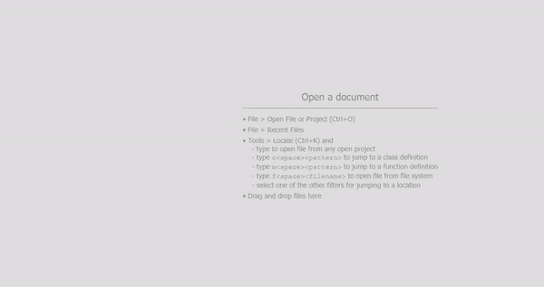
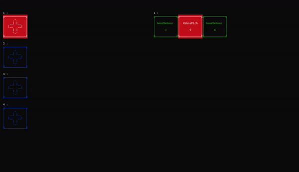

# Kastel Card Game

**Kastel** is a reproduction of the card game **NOX**, implemented after I completed my basic programming courses. The game can be played by 2 to 6 players, and the rules are explained in the PDF attached below.

[Download the PDF with game rules](readme-media/Kastel.pdf)

At the time, I made a significant effort to structure the project using **object-oriented programming (OOP)** principles (it was my first time having a 6-line `main` function! 😊). I also added creative touches to enhance the game’s presentation. For instance, I had just learned about UTF-8 encoding and managed to create a beautiful opening animation for the game.

I focused on implementing a **console-based UI/UX** with a smooth gameplay experience. You can control the game using the arrow keys and the spacebar.

### Features:
- **Player support**: 2 to 6 players.
- **OOP implementation**: The game is structured using object-oriented programming principles.
- **UTF-8 integration**: Added a stylish opening animation using UTF-8 characters.
- **Console-based UI**: Play the game using arrow keys and spacebar for a simple and intuitive experience.
- **Sound playback**: The game includes sound effects to enhance the gameplay experience.

### Game Preview:
- [Download the preview](readme-media/Preview.mp4)

Building this project was a fantastic experience for me, as it helped me dive deeper into OOP concepts, discover new programming techniques, and unleash my creativity.
